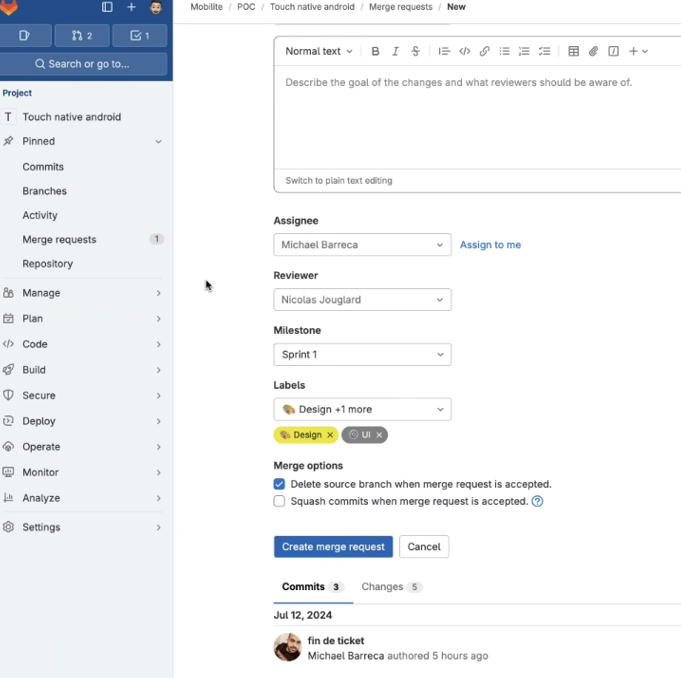
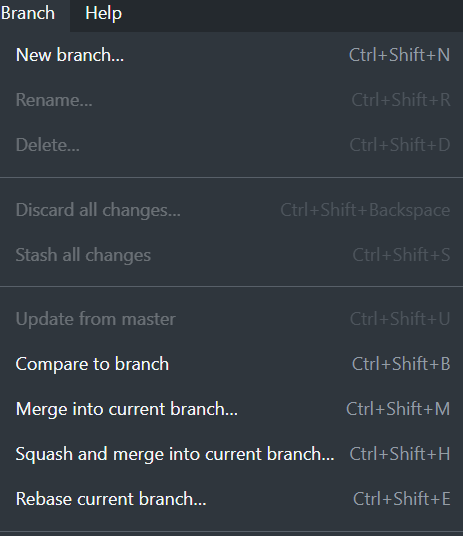

    

        <h2> GitHub Desktop ! </h2>  
        

 

        <h2> Comment crée une MR ! </h2>  
        
        
 Ne pas clôturer une MR!

 

        <h2> Click sur rebase to master pour mettre à jour le projet ! </h2>  
        

