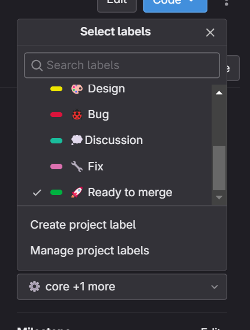

    

        <h2> GitHub Desktop ! </h2>  
        

 

        <h2> Comment crée une MR ! </h2> 
         
        
 Ne pas clôturer une MR! "c'est au responsable de le faire"

         
        
 Tu crée une MR alors coche DRAFT !

         
        
 Tu fini une MR alors dans label rajoute Ready to merge !

 

        <h2> Click sur rebase to master pour mettre à jour le projet ! </h2>  
        

