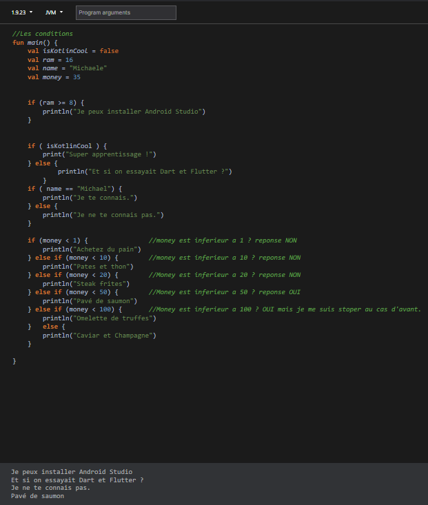

    

        <h2> Les boucles ! </h2>  
        

        <h2> Les conditions if else ! </h2>  
        

        <h2> Les conditions when ! </h2>  
        

        <h2> Deballer non null ! </h2>  
          

        <h2> Do while ! </h2>  
        

        <h2> If else en une ligne ! </h2>  
        

        <h2> Les conditions in / supp</h2>  
        

        <h2> Les conditions bonne pratique</h2>  
        

