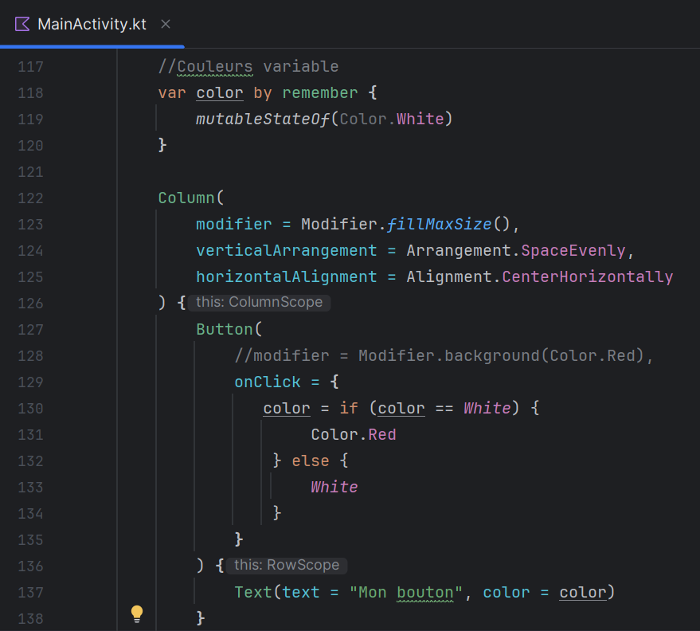
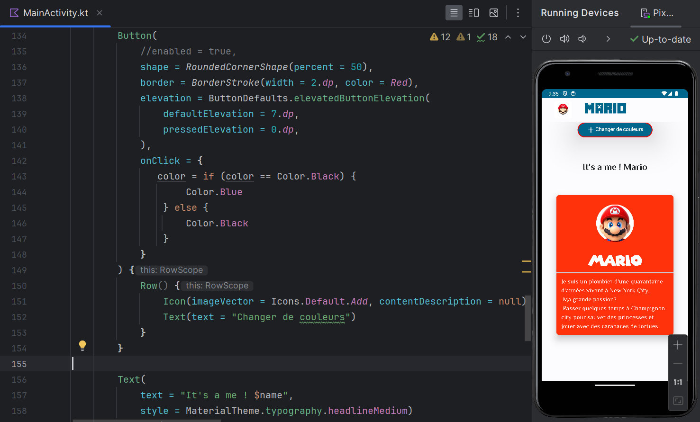
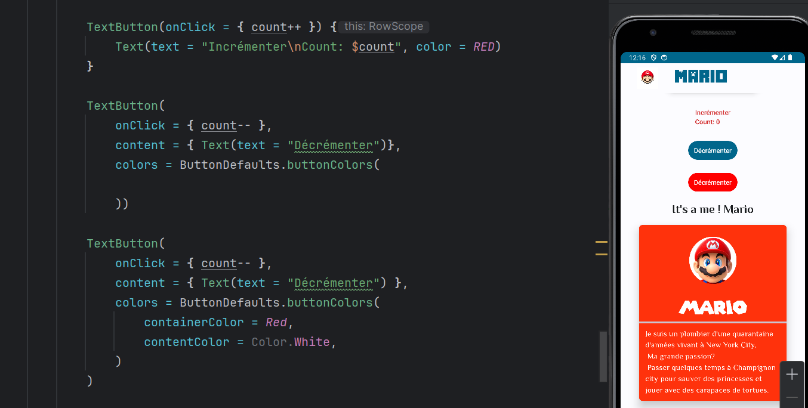
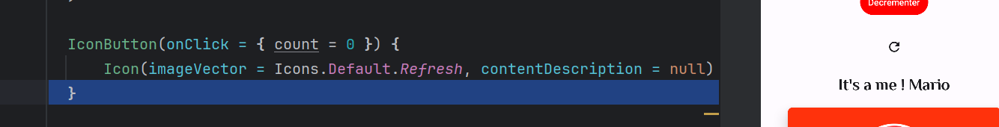
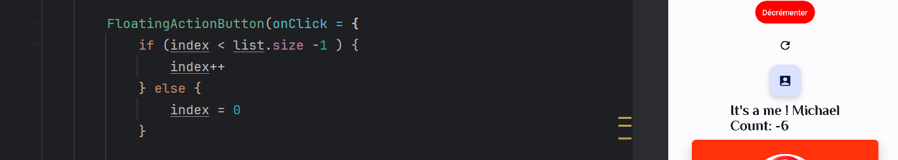

    

        <h2> Les conditions en buttons ! </h2>  
        

        <h2> Les elevations ! </h2>  
        

        <h2> Les texts buttons ! </h2>  
        

        <h2> Les trois types de buttons ! </h2>  
          

        <h2> Les buttons icon ! </h2>  
        
Le buttons en exemple permet de reset le count à zero.

          

        <h2> Les buttons floating icon ! </h2>  
          

