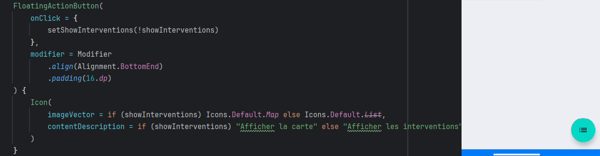
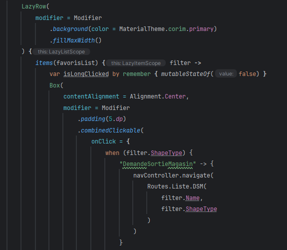
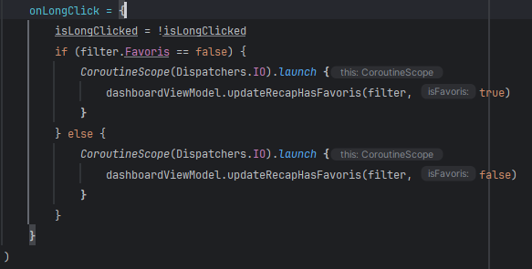
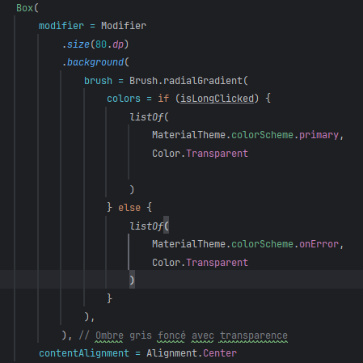

    

        <h2> Les conditions en buttons ! </h2>  
        

        <h2> Les elevations ! </h2>  
        

        <h2> Les texts buttons ! </h2>  
        

        <h2> Les trois types de buttons ! </h2>  
          

        <h2> Les buttons icon ! </h2>  
        
Le buttons en exemple permet de reset le count à zero.

          

        <h2> Les buttons floating icon ! </h2>  
        
Il faut rajouter les variables pour les appeler dans le buttons.

        
Permet de changer de nom au clic.

        
var list = listOf < String >("Michael", "Cassy", "Candy", "José")

        
var index by remember { mutableStateOf(0) }

          

        <h2> Les buttons floating icon avec conditions ! </h2>  
        
Crée un icone a condition qui change d'aspect au click du button.

        
val (showInterventions, setShowInterventions) = remember { mutableStateOf(true) }

          

        <h2> Les buttons combinedClickable avec conditions ! </h2>  
        
Crée une variable.

        
        
La condition

          
        
La couleurs

          

