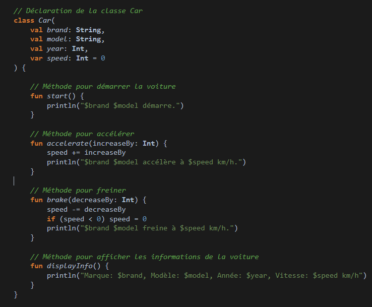
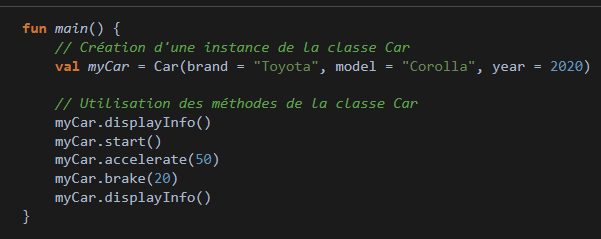

    

        <h2>Je crée une class voiture avec des fonctions dans ma class !</h2>  
        

        <h2> Je crée une variable dans main avec les propriété de ma voiture et j'appel mes fonctions ! </h2>  
        

