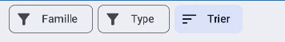
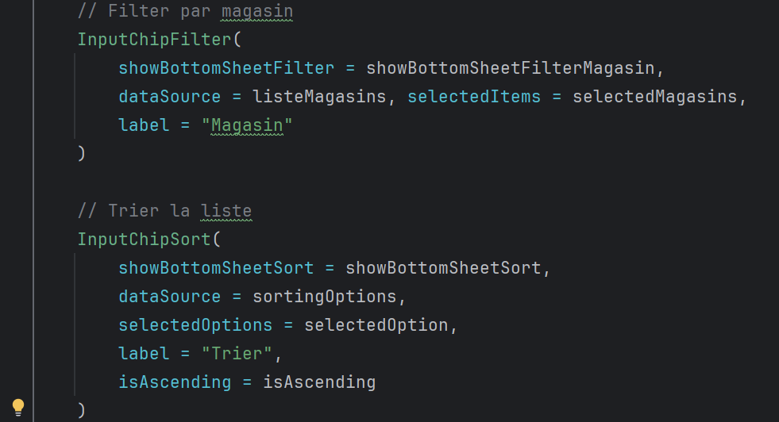
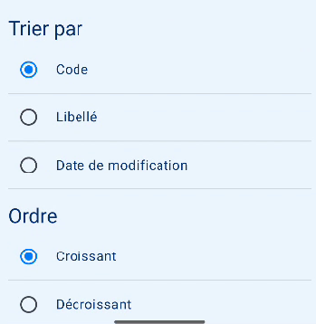
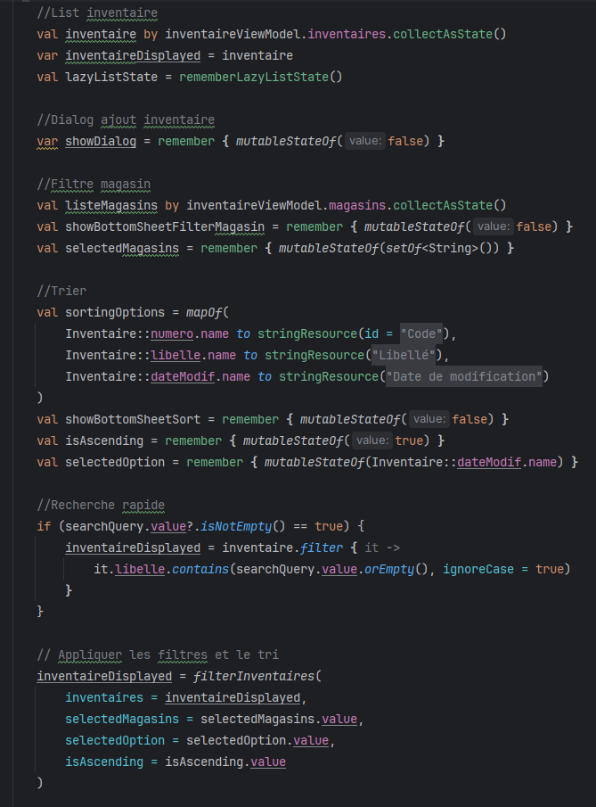
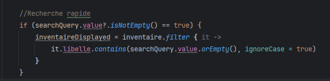
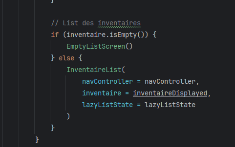

    

        <h2>Création d'un système de filtre et de trie !</h2>  
        

 
        

 

        <h2>Je crée le design d'un filtre !</h2>
          
        
Les filtres
 
          
        
Les tries
 
        

 

        <h2>Les variables !</h2>  
        
Je crée les variables que je vais utilisé dans ma recherche de filtre.
 
        

 

        <h2>Le système de filtre !</h2>  
        
Je reprends ma variable inventaireDisplayed qui va me permettre d'appeler mes variables filtrées sur mon objet inventaire. C'est donc à partir de ma variable inventaireDisplayed que ma liste d'inventaire va se mettre à jour et s'afficher en fonction du choix de mon filtre.
 
        

 

        <h2>La mise à jour de la liste !</h2>  
        
Ici, dans la liste, on peut dire que si IF, alors j'appelle ma variable inventaire qui va me renvoyer la totalité de ma liste (non filtrée). SINON, ELSE affiche ma liste filtrée avec l'appel de ma variable inventaireDisplayed.
 
        
Si, par exemple, à la place de cette variable j'avais laissé inventaire, mon filtre ne serait pas pris en compte et donc la liste ne s'afficherait pas autrement.
 
        

