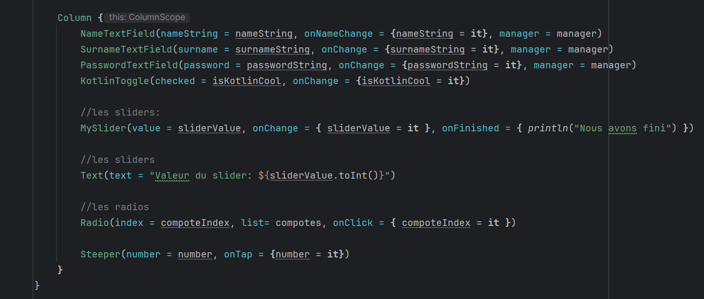

    

        <h2> Le parents ! </h2>  
        
Crée un composable en tête de fichier pour bien le distinguer des autres composables et appeler sa fonction par la suite. Ce composant, que j'appelle enfant, n'est en réalité qu'un composant avec un nom de fonction. Pour résumer, il s'agit d'un composant dans une liste de composants formant un corps.

          

        <h2> Le composant Textfiled ! </h2>  
        

