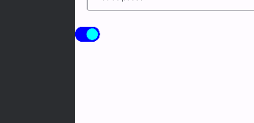

    

        <h2> Le parents ! </h2>  
        
Crée un composable en tête de fichier pour bien le distinguer des autres composables et appeler sa fonction par la suite. Ce composant, que j'appelle enfant, n'est en réalité qu'un composant avec un nom de fonction. Pour résumer, il s'agit d'un composant dans une liste de composants formant un corps.

          

        <h2> Le composant Textfiled ! </h2>  
        

 

        <h2> Les conditions ! </h2>  
        
Je rajoute dans la colonne les variables que je vais utiliser dans mon second composant.

          

        <h2> Le composant Textfiled avec condition error et longueur de la valeur ! </h2>  
        

 

        <h2>Les options sur les textfiled !</h2>  
        
Sur ce bouton, je vais pouvoir utiliser la propriété next qui va me permettre de passer du champ texte 1 au champ texte 2 en appuyant sur le clavier. En bas à droite, une flèche bleue est apparue.

        
          
        
        
Sur ce bouton, je vais pouvoir utiliser la propriété 'down' qui va me permettre de fermer le clavier apparu.

        

 

        <h2> Cacher ou non le password ! </h2>  
        

 

        <h2> Le button radio ! </h2>  
        
        
        

 