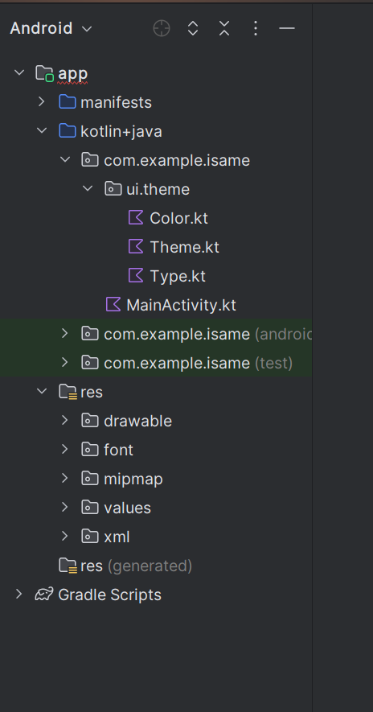

    

        <h2> Les textes ! </h2>  
        
Pour installer une nouvelle typographie, vous devez l'importer directement dans le fichier res.

        

        <h2> Les images ! </h2>  
        

        <h2> Les icones ! </h2>  
        

        <h2> Les IconVector ! </h2>  
          

        <h2> Les columns ! </h2>  
        

        <h2> Les rows ! </h2>  
        

        <h2> Les surfaces ! </h2>  
        

        <h2> Les boxs ! </h2>  
        

        <h2> Les spacers ! </h2>  
        

