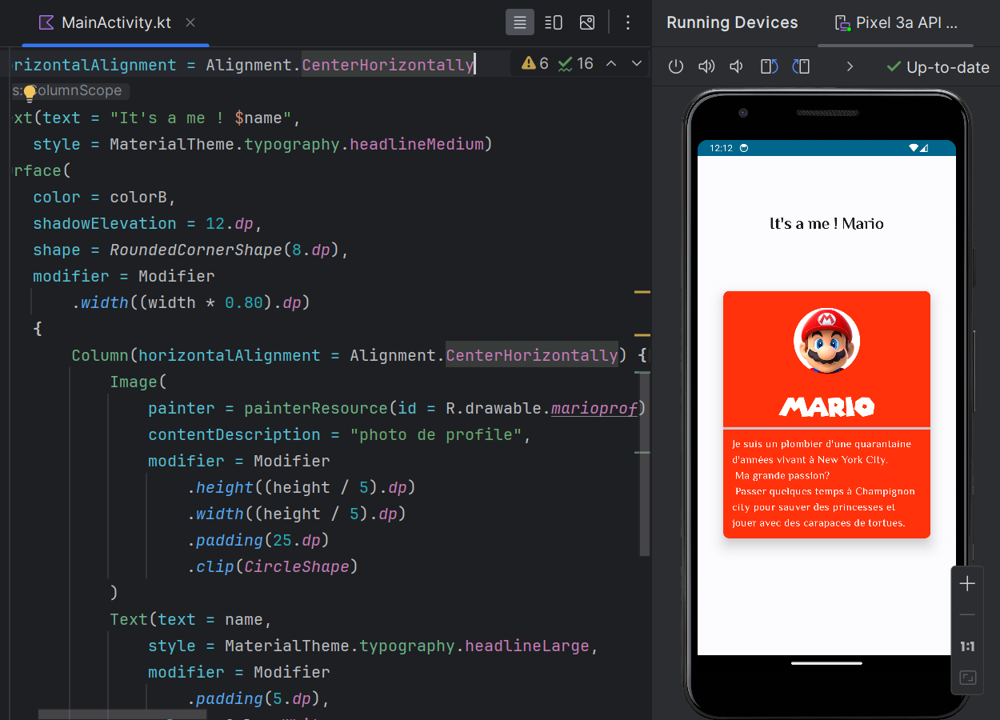

    

        <h2> Les textes ! </h2>  
        
Pour installer une nouvelle typographie, vous devez l'importer directement dans le fichier res.
 
        

        <h2> Appel mes fonts ! </h2>  
        

        <h2> Ajouter des paramettres a nos typographie ! </h2>  
        

        <h2> Exemple d'utilisation ! </h2>  
        

