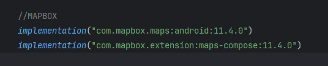

    

        <h2>Source Tutorial !</h2>  
        
Video : Mise en place

        <h2>MAPBOX sur Android Kotlin !</h2>  
        

        <h2>Ajout des dépendances !</h2>  
        

        <h2>Ajout du maeven !</h2>  
        

        <h2>Ajout du maeven !</h2>  
        

        <h2>Ajout de la clée Token dans le : settings.gradle.kts !</h2>  
        

        <h2>Ajout des permission dans le : AndroidManifest.xml !</h2>  
        

        <h2>Ajout de la clée token dans le nouveau fichier : developer-config.xml !</h2>  
        

        <h2>Ajout de la clée token dans le nouveau fichier : developer-config.xml !</h2>  
        

        <h2>Dans le composable : les permissions !</h2>  
        

        <h2>Dans le composable : la class marker !</h2>  
        

        <h2>Dans le composable : la list des markers !</h2>  
        

        <h2>Dans le composable : les permissions dans le manifest !</h2>  
        

        <h2>Dans le composable : les permissions dans le manifest !</h2>  
        

        <h2>Dans le composable : la column jusqu'au forEach !</h2>  
        

        <h2>Dans le composable : le maker et la localisation !</h2>  
        

        <h2>Dans le composable : la localisation !</h2>  
        

