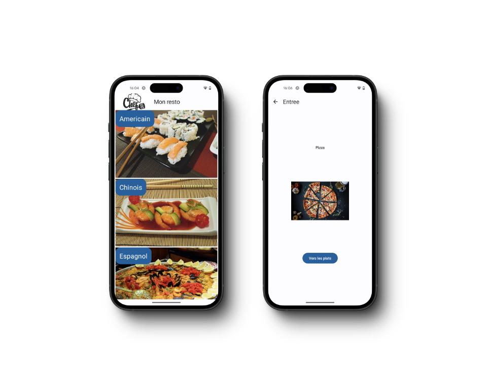
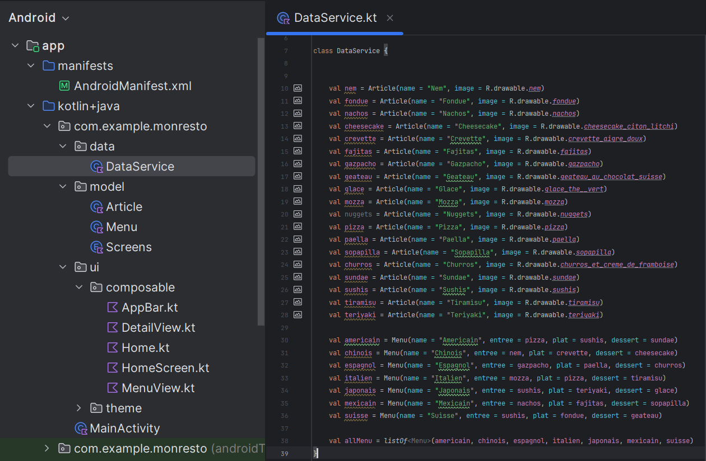
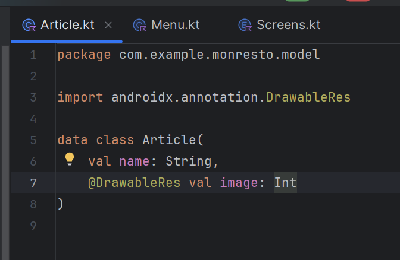
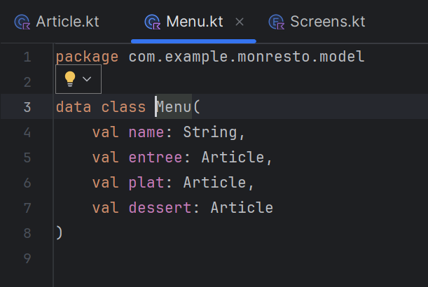
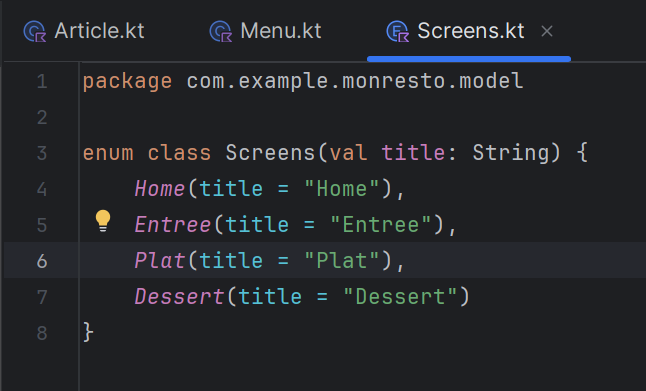

    

        <h2> Le projet ! </h2>  
        

 

        <h2> Mise en place de la data ! </h2>  
        

        <h2> Création des models ! </h2>  
        
        
        

        <h2> Avec la data ! </h2>  
        

