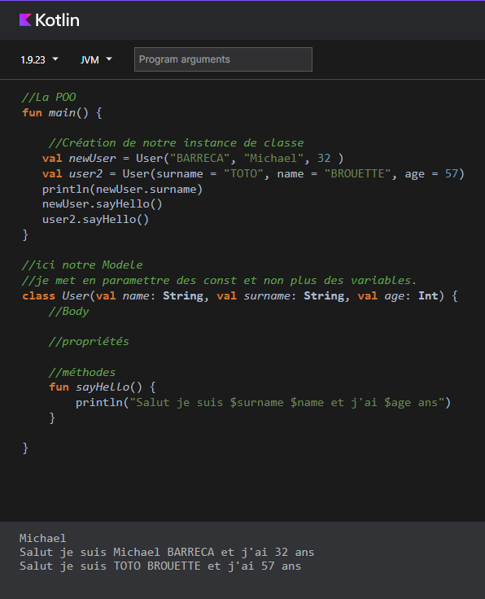
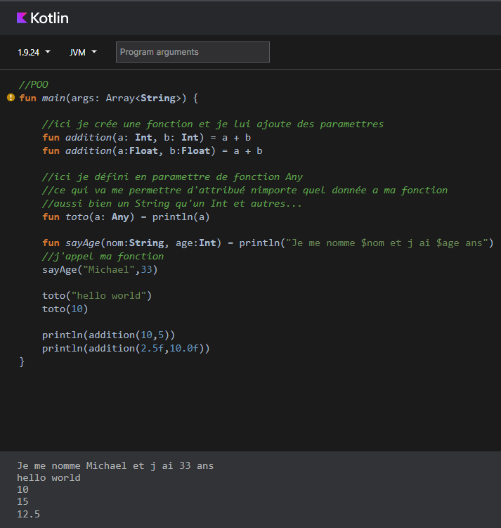
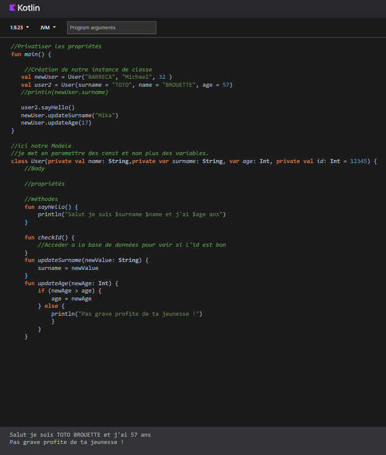
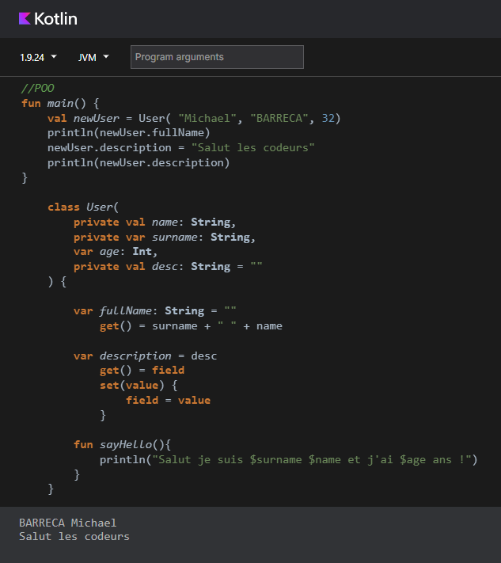
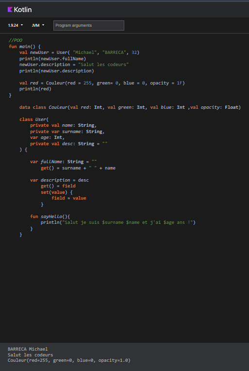
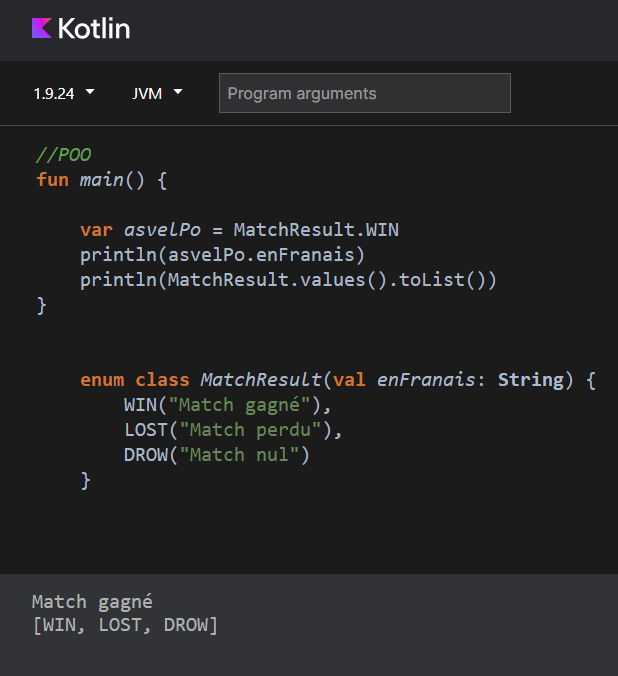

    

        <h2>La POO !</h2>  
        

        <h2> J'appelle une méthode ! </h2>  
        

        <h2> Les paramètres ! </h2>  
        

        <h2> Les functions ! </h2>  
        

        <h2> Les propriétés privées ! </h2>  
        

        <h2> Les propriétés calculé ! </h2>  
        

        <h2> Les data class ! </h2>  
        

        <h2> Les enum ! </h2>  
        

